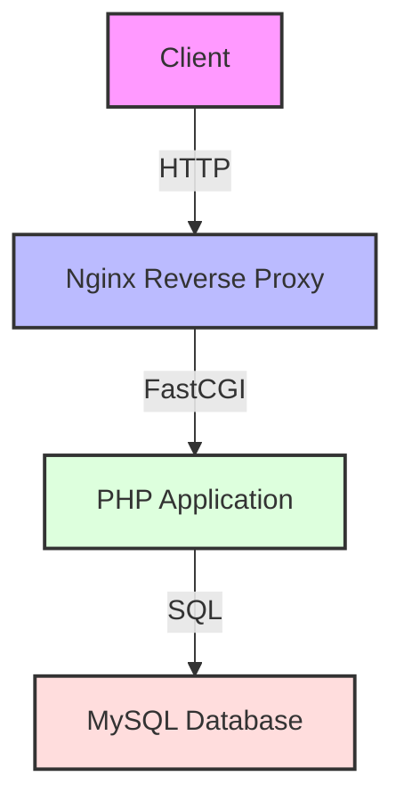

<div align="center">

# 🎯 Three-Tier Application Deployment
### MySQL • PHP • Nginx on Kubernetes

[](https://kubernetes.io/)
[](https://www.docker.com/)
[](https://www.mysql.com/)
[](https://www.php.net/)
[](https://nginx.org/)

<p align="center">
  
</p>

</div>

## 🚀 Overview

This repository provides a comprehensive solution for deploying a three-tier application using MySQL, PHP, and Nginx on Kubernetes. The entire application is containerized using Docker and orchestrated with Kubernetes, offering a scalable and maintainable architecture.

### 🏗️ Architecture Components



## 📋 Prerequisites

Before you begin, ensure you have the following tools installed:

- 🛠️ Kubernetes Cluster (Minikube, Kind, or any other Kubernetes cluster)
- 🎮 kubectl - Kubernetes command-line tool
- 🐳 Docker - Container platform
- 🗄️ MySQL Client - Database management tool

## 🚀 Deployment Steps

### 1️⃣ Clone the Repository

```bash
git clone <repository-url>
cd <repository-directory>
```

### 2️⃣ Build and Push Docker Image

```bash
# Build the Docker image
docker build -t minhajms/php-mysql-test:2.0 .

# Push to Docker Hub
docker push minhajms/php-mysql-test:2.0
```

### 3️⃣ Deploy Components

```bash
# Deploy MySQL
kubectl apply -f mysql-deployment.yaml

# Deploy PHP Application
kubectl apply -f website-deployment.yaml

# Deploy Nginx
kubectl apply -f nginx-deployment.yaml
```

### 4️⃣ Verify Deployments

```bash
# Check MySQL pods
kubectl get pods -n mysql-ns

# Check PHP application pods
kubectl get pods -n website-ns

# Check Nginx pods
kubectl get pods -n nginx-ns
```

## 🔍 Troubleshooting Guide

### Common Issues and Solutions

| Issue | Solution |
|-------|----------|
| Empty `/var/www/html` Directory | Remove PVC mount from PHP deployment |
| MySQL Connection Issues | Update PHP to decode base64 MySQL password |
| MySQL Authentication Issues | Configure root user for PHP pod access |

## 💼 Features

- ✨ Modern UI with Tailwind CSS
- 👥 Employee Management System
- ✅ Form Validation
- 🗃️ Employee Directory
- ⚡ Real-time Updates

## 📁 Repository Structure

```
.
├── 📄 mysql-deployment.yaml
├── 📄 nginx-deployment.yaml
├── 📄 website-deployment.yaml
├── 🐳 Dockerfile
└── 📝 index.php
```

## 🔧 Configuration Files

### mysql-deployment.yaml
- 🗄️ Database deployment configuration
- 💾 PersistentVolumeClaim setup
- 🔌 Port 3306 exposure

### nginx-deployment.yaml
- 🔄 Reverse proxy configuration
- 🛣️ Traffic routing rules
- 🔌 Port 80 exposure

### website-deployment.yaml
- 🖥️ PHP application deployment
- 🔐 Environment variables
- 🔌 Application port configuration

## 📝 Appendix

### Useful Commands

```bash
# Get Nginx LoadBalancer IP
kubectl get svc -n nginx-ns nginx-loadbalancer

# Update deployment image
kubectl set image -n website-ns deployment/website website=minhajms/php-mysql-test:2.0
```

## 📫 Support

For issues and feature requests, please [open an issue](https://github.com/yourusername/project/issues) in this repository.

## 📄 License

This project is licensed under the MIT License - see the [LICENSE](LICENSE) file for details.

---
<div align="center">
Made with ❤️ by Your Organization Name
</div>
