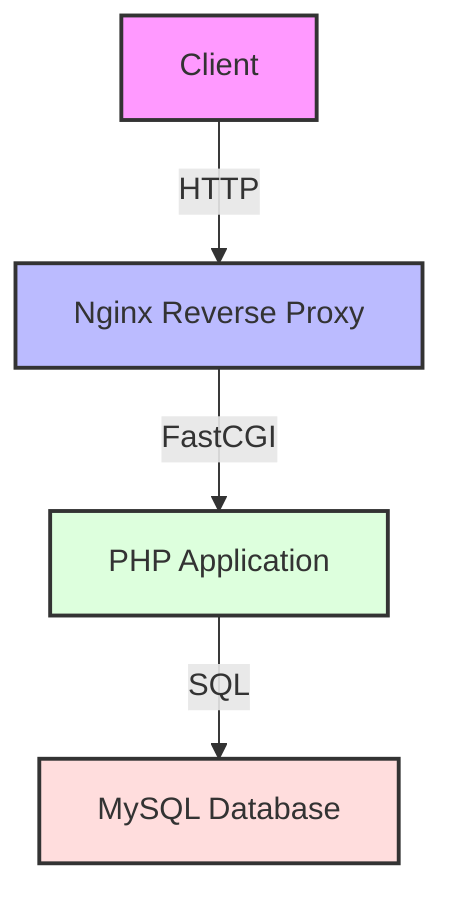

<div align="center">

# 🎯 Three-Tier Application Deployment
### MySQL • PHP • Nginx on Kubernetes

[](https://kubernetes.io/)
[](https://www.docker.com/)
[](https://www.mysql.com/)
[](https://www.php.net/)
[](https://nginx.org/)

</div>

## 🚀 Overview

This repository provides a comprehensive solution for deploying a three-tier application using MySQL, PHP, and Nginx on Kubernetes. The entire application is containerized using Docker and orchestrated with Kubernetes, offering a scalable and maintainable architecture.

### 🏗️ Architecture Components



## 📋 Prerequisites

Before you begin, ensure you have the following tools installed:

- 🛠️ Kubernetes Cluster (Minikube, Kind, or any other Kubernetes cluster)
- 🎮 kubectl - Kubernetes command-line tool
- 🐳 Docker - Container platform
- 🗄️ MySQL Client - Database management tool

## 🚀 Deployment Steps

### 1️⃣ Clone the Repository

```bash
git clone <repository-url>
cd <repository-directory>
```

### 2️⃣ Configure MySQL Secret

```bash
# Apply MySQL secret configuration
kubectl apply -f mysql-secret.yaml
```

### 3️⃣ Deploy Components

```bash
# Deploy MySQL
kubectl apply -f mysql-deployment.yaml

# Deploy PHP Application
kubectl apply -f website-deployment.yaml

# Deploy Nginx
kubectl apply -f nginx-deployment.yaml
```

### 4️⃣ Verify Deployments

```bash
# Check MySQL pods
kubectl get pods -n mysql-ns

# Check PHP application pods
kubectl get pods -n website-ns

# Check Nginx pods
kubectl get pods -n nginx-ns
```

## 🔍 Troubleshooting Guide

### Common Issues and Solutions

| Issue | Solution |
|-------|----------|
| MySQL Connection Issues | Verify mysql-secret.yaml is properly applied |
| MySQL Authentication Issues | Check secret credentials in mysql-secret.yaml |
| Service Connection Issues | Verify service names and namespaces match |
| Pod Startup Failures | Check pod events and logs using `kubectl describe pod` and `kubectl logs` |
| Volume Mount Issues | Verify PVC creation and binding status |

## 💼 Features

- ✨ Modern Architecture
- 🔒 Secure Database Configuration
- 🚀 Scalable Deployment
- 🔄 Load Balancing
- 🛡️ Namespace Isolation
- 📊 Resource Management

## 📁 Repository Structure

```
.
├── 📄 README.md
├── 📄 mysql-deployment.yaml
├── 📄 mysql-secret.yaml
├── 📄 nginx-deployment.yaml
└── 📄 website-deployment.yaml
```

## 🔧 Configuration Files

### mysql-secret.yaml
- 🔐 Database credentials configuration
- 🗝️ Sensitive data stored as Kubernetes secrets
- 🔒 Base64 encoded values
- 🔑 Root password and database configuration

### mysql-deployment.yaml
- 🗄️ Database deployment configuration
- 💾 PersistentVolumeClaim setup
- 🔌 Port 3306 exposure
- 📦 Container resource limits
- 🔄 Replication configuration

### nginx-deployment.yaml
- 🔄 Reverse proxy configuration
- 🛣️ Traffic routing rules
- 🔌 Port 80 exposure
- ⚖️ Load balancer settings
- 🔍 Health check configuration

### website-deployment.yaml
- 🖥️ PHP application deployment
- 🔐 Environment variables
- 🔌 Application port configuration
- 📈 Scaling parameters
- 🏷️ Resource requests and limits

## 📝 Appendix

### Useful Commands

```bash
# Get Nginx LoadBalancer IP
kubectl get svc -n nginx-ns nginx-loadbalancer

# Check secrets
kubectl get secrets -n mysql-ns

# Describe deployments
kubectl describe deployment -n mysql-ns mysql
kubectl describe deployment -n website-ns website
kubectl describe deployment -n nginx-ns nginx

# View logs
kubectl logs -n mysql-ns deployment/mysql
kubectl logs -n website-ns deployment/website
kubectl logs -n nginx-ns deployment/nginx

# Scale deployments
kubectl scale deployment -n website-ns website --replicas=3

# Check PVC status
kubectl get pvc -n mysql-ns
```

### Namespace Management

```bash
# Create namespaces
kubectl create namespace mysql-ns
kubectl create namespace website-ns
kubectl create namespace nginx-ns

# View namespaces
kubectl get namespaces

# Set context to specific namespace
kubectl config set-context --current --namespace=<namespace>
```

### Resource Monitoring

```bash
# Monitor pod resource usage
kubectl top pods -n mysql-ns
kubectl top pods -n website-ns
kubectl top pods -n nginx-ns

# View node resource allocation
kubectl top nodes
```

## 📫 Support

For issues and feature requests, please open an issue in this repository. For urgent support:

1. Check the troubleshooting guide above
2. Review pod logs and events
3. Open an issue with relevant logs and error messages
4. Tag maintainers for critical issues

## 📄 License

This project is licensed under the MIT License - see the LICENSE file for details.

## 🤝 Contributing

1. Fork the repository
2. Create your feature branch (`git checkout -b feature/AmazingFeature`)
3. Commit your changes (`git commit -m 'Add some AmazingFeature'`)
4. Push to the branch (`git push origin feature/AmazingFeature`)
5. Open a Pull Request

---
<div align="center">
Made with ❤️ 
</div>
